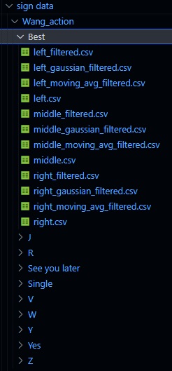
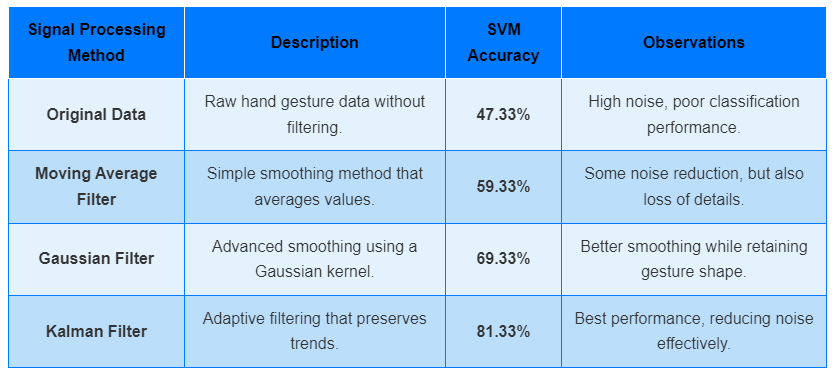

CSC02F Applied Signal Processing Final Report
m5281054 WANG Binghao

## Project Introduction

Gesture recognition is widely used in HCI, VR, sign language translation and other fields, but hand tracking data is often affected by noise and jitter, which reduces recognition accuracy. This study uses 3D hand key point data generated by MediaPipe, uses Kalman filtering, moving average filtering and Gaussian filtering for signal preprocessing, and uses SVM for gesture classification to analyze the impact of signal processing on classification accuracy. The experiment will explore the role of different filtering parameters on recognition effect, and further optimize the smoothing method to improve the stability and robustness of the model, proving the importance of signal processing technology in gesture recognition.

## Environment
Windows10
conda
Python 3.11

## Dataset
This experiment consists of 150 gesture videos consisting of 10 gestures in 3 directions by 5 people.

Run the following code in the conda environment to convert the video into a csv file
```python
python VideoToCsv.py
```
After the conversion, the data needs to be preprocessed, the action intervals are divided and each action is resampled to 100 frames. Run the following code in the conda environment
```python
python Data_processing.py
```
## Signal Processing
Run the following code in the conda environment to perform Kalman filtering on the csv file
```python
python Kalman_Filter.py
```
Run the following code in the conda environment to perform moving average filtering on the csv file
```python
python moving_average_filter.py
```
Run the following code in the conda environment to perform Gaussian filtering on the csv file
```python
python gaussian_filtered.py
```
We have obtained four csv file data sets, namely the source data, the data after Gaussian filtering, Kalman filtering and moving average filtering. In this experiment, the data sets up to this step have been prepared in *CSC02F Applied Signal Processing\Final project\sign data*


## Training SVM Validation Test Accuracy
Run the following commands in the conda environment to train and test the data:
```python
python gaussian_filtered.py
```
In the code gaussian_filtered.py, different signal processed data sets are selected by changing the annotations
```python
# Select data processing method (just modify here)
# filter_type = "original" # Original data
# filter_type = "kalman" # Kalman filter
# filter_type = "moving_avg" # Moving average filter
filter_type = "gaussian" # Gaussian filter
```
## Result
Finally, I got a result. I have obtained the result and drawn a table


### Signal data visualization
During the experiment, if you want to view a data line graph after a certain signal processing, you can run the following command in the conda environment.In the Data_Visualization.py code, we need to change the file address to the address of the file we want to view.

```python
python Data_Visualization.py
```
